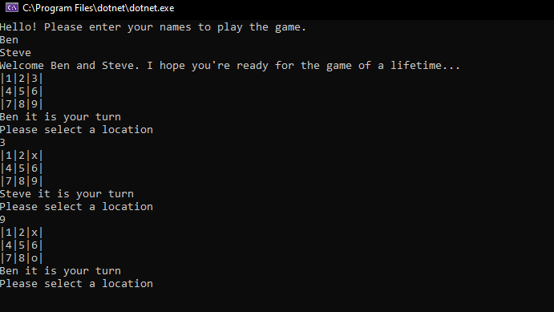

# Lab04-Classes-Objects

# Tic Tac Toe

To play this game, 
- git clone to files to your favorite directory. You can clone it from here: https://github.com/Kozer2/Lab04-Classes-Objects.git 
- - Using Visual Studio you can then open this code. 
- From there hit the green run button and play the game!

Here is a sample of the game window. 

